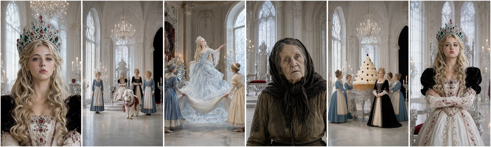
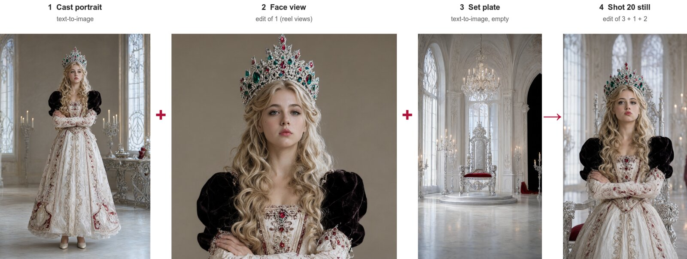
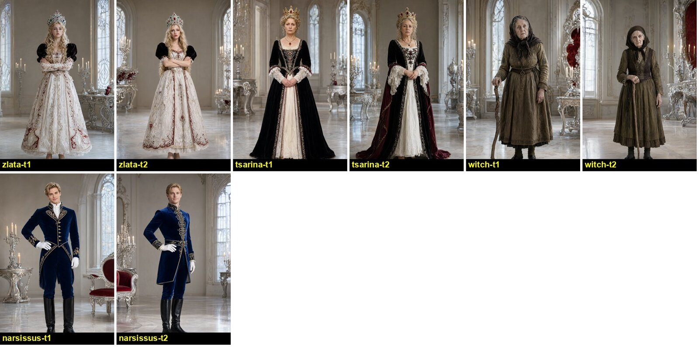
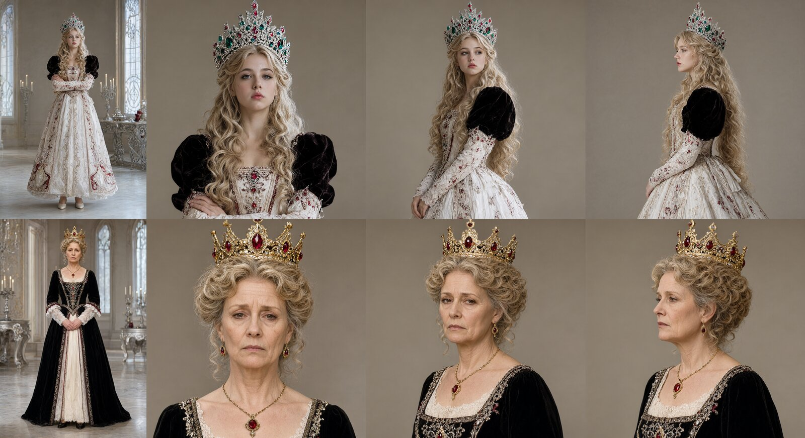
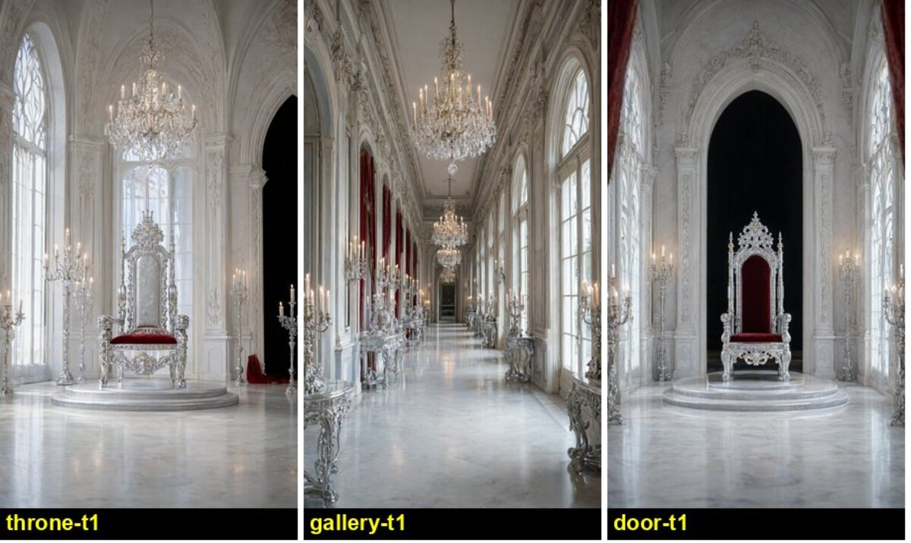
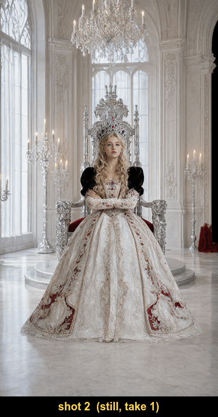
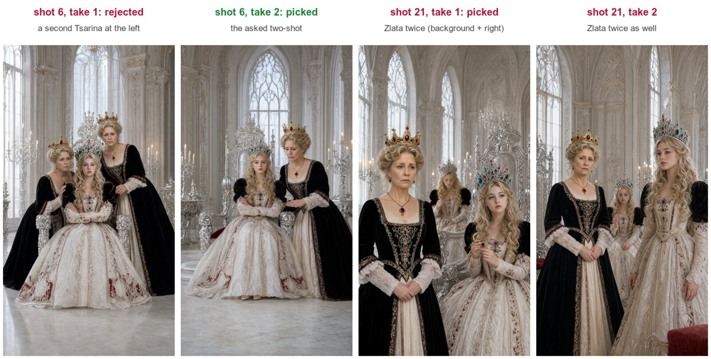
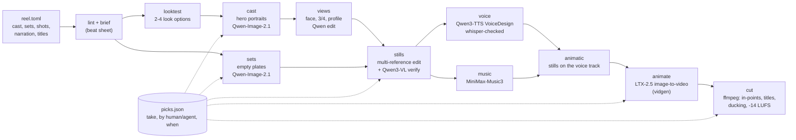
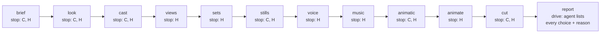

# reel-studio



<sub>All images in this README are AI-generated (Qwen-Image-2.1 on a Mac) for the example project `too-much`. No real people.</sub>

**An image-first AI reel pipeline that runs entirely on one Mac.** It is inspired by the still-first workflow AI
short creators use (image model → image edit → image-to-video → music), rebuilt with local open-weights models
and driven by one CLI, `bin/reel`. You write a reel as a single TOML file: cast, sets, 25-40 shots, narration,
titles. The pipeline designs a hero portrait of every character and an empty plate of every set. It then edits
those same references into every shot's first frame, so faces and costumes stay consistent. Each still is
animated for a few seconds with LTX-2.5, a designed-voice narrator and a music bed are laid over the top, and
ffmpeg cuts the result into a 30-120 s 9:16 reel with burned-in titles. A **control dial** sets how much the
human decides and how much an agent decides (Claude Code, or [pi](https://github.com/earendil-works/pi) on a local
vision model). Every pick is recorded with who made it. Built for Apple Silicon (MLX), about 1.1k lines of
Python and shell.

## Contents

- [What it makes](#what-it-makes)
- [How it works](#how-it-works)
- [Who decides: the control dial](#who-decides-the-control-dial)
- [Measurements](#measurements)
- [Requirements](#requirements)
- [Setup](#setup)
- [Usage](#usage)
- [Status and limitations](#status-and-limitations)
- [Credits and licences](#credits-and-licences)

## What it makes

The worked example is **`projects/too-much`**: *Too Much Is Never Enough*, a 38-shot, 115 s fairy-tale comedy
about a spoiled princess, written as a screenplay by the repo's author (`projects/too-much/screenplay.md`). The
reel is being made in **drive mode**: pi, running a local Qwen3.8 model, makes every pick with no human input and
no re-shoots. That run was still in progress when this snapshot was taken (stills done through shot 28, shot 29 rendering; no clips
or cut yet). So everything below is real output from the cast, views, sets and stills stages.

**The CLI, live.** Real output from the run as it rendered (read-only commands, 2026-10-05 ~21:45; long lines
cut at `…`, and `…` rows elided):

```console
$ bin/reel lint too-much
38 shots, 114.90 s; 18 narration lines; 0 problem(s)

$ bin/reel brief too-much
# Too Much Is Never Enough - beat sheet

38 shots, 114.9 s, 704x1280, language english, control drive

| # | at | len | shot | place | who | what we see | heard |
|---|---|---|---|---|---|---|---|
| 1 | 0.0 | 3.5 | Title card | - | - | a near-black background with a faint ruby-red ornamental fairy-tale border …
| 2 | 3.5 | 4.2 | Medium shot | throne | zlata | Zlata sits dead centre on the silver throne with her arms crossed …
| 3 | 7.7 | 2.0 | Tight frontal close-up from Zlata's kokoshnik band to her collarbones | throne | zlata | …
…

$ bin/reel status too-much
Too Much Is Never Enough: 38 shots, 114.90 s, media ~/Videos/reel-studio/too-much
  control: drive, no stops
  brief: not approved (reel brief, then reel approve)
  cast zlata          2 take(s), pick t1 (agent)
  cast tsarina        2 take(s), pick t1 (agent)
  cast witch          2 take(s), pick t1 (agent)
  cast narsissus      2 take(s), pick t1 (agent)
  set  throne         1 take(s), pick t1 (agent)
  set  gallery        1 take(s), pick t1 (agent)
  set  door           1 take(s), pick t1 (agent)
  shot  1  3.50s  still: 2 take(s), pick t1 (agent) clip: -
  …
  shot  6  4.00s  still: 2 take(s), pick t2 (agent) clip: -
  …
  shot 24  2.60s  still: 2 take(s), pick t1 (agent) clip: -
  shot 25  3.40s  still: 2 take(s), pick t1 (default) clip: -
  …
  shot 29  2.80s  still: 1 take(s), pick t1 (default) clip: -
  shot 30  3.00s  still: -                      clip: -
  …
  shot 38  5.00s  still: -                      clip: -
  audio/narration.wav    -
  audio/music.wav        -
  cut/too-much.mp4       -

$ bin/reel gate too-much stills
GO: 'stills' is not a checkpoint in drive mode; pick by your own review and carry on.
```

<sub>The brief is "not approved" because drive mode skips the human sign-off; `(default)` means no pick has been
recorded yet, so take 1 is used.</sub>

**From references to a shot.** Every shot that has a recurring character is an *edit*, not a fresh generation. The
set plate, the character's portrait and their face view go in as numbered references ("Picture 1: the place.
Picture 2: Zlata. ..."), and Qwen-Image-2.1 edit composes the shot:



**The cast** (`reel cast --takes 2`; pi picked take 1 of each) and **identity views** (`reel views`: face,
three-quarter and profile, drawn from the picked portrait by the edit model):





**The sets** are empty plates rendered at twice the reel's size (`reel sets`):



<sub>The doorway plate came back with a throne in front of the arch. Drive mode allowed no re-shoot, so pi kept it
and wrote a lesson for the next round ("say: no throne in frame, empty floor leading to the arch").</sub>

**The picked stills in shot order** (shots 2-24; these are first frames, not yet animated):



**What goes wrong.** The commonest failure is a doubled person: with 5 references, Qwen sometimes draws a
character twice. pi caught it in shot 6. In shot 21 *both* takes had a second Zlata in the background, and pi's
review only flagged one of them. A human checkpoint (or a face-count check) would catch this; drive mode as run
here does not.



## How it works



- **One project file.** `projects/<p>/reel.toml` holds the cast (one fixed sentence each, plus a voice), the sets,
  and every shot (`dur`, `still`, `motion`, `audio`), plus the narration lines, title overlays, look and music
  prompt. `reel lint` checks it, and `reel brief` turns it into a one-line-per-shot beat sheet.
- **Consistency comes from references.** A still is an edit of the picked set plate, the picked portrait and the
  face view of every character in the shot, in the "Picture N:" prompt form the edit model was trained on.
  Extras (maids, servants) are described in the shot text and never cast, because a shared reference gives them
  all the same face.
- **Every take is kept.** Takes are numbered (`s20-t1.png`, `s20-t2.png`), a redo adds a take, and `reel pick`
  chooses one. The choice goes into `picks.json` with who made it and when.
- **Voice first, then video.** Narration is whisper-checked against the script and re-spoken when the words come
  out wrong. The animatic holds each still for its shot length on the voice track, so pacing gets fixed before any
  GPU time goes on video.
- **The cut** trims each LTX take from its in-point on the reel's frame clock and overlays typewriter titles as
  PNG sequences. It sidechain-ducks the takes' sound and the music under the narrator, then loudness-normalises
  the mix.
- **The GPU is shared politely.** On the author's Mac each GPU stage re-runs itself inside `hold run` (from
  [local-rig](https://github.com/mthomas100/local-rig)), which queues behind other renders and unloads the local
  LLM only while the stage runs. Without `hold` the stages simply run.
- **Studying a reference.** `bin/reverse` takes a reference video apart on the CPU: cut detection, per-shot frame
  strips, Demucs stems, a whisper transcript, voice pitch per line, music tempo and key. The `reel-reverse` skill
  turns that into a plan for an *original* reel with the same rhythm. The teardown stays private: it never goes
  into a project's inputs or into a repo.

Design notes: `docs/craft.md` (prompt rules for stills, edits, motion and the cut, with sources) and
`docs/models.md` (why each model, with the alternatives and licences).

## Who decides: the control dial

`[control] mode` in the project file. After every stage the agent runs `reel gate <p> <stage>`. Exit 3 means stop:
put the result in front of the human (`reel open`), propose picks and wait. Exit 0 means pick by its own review
and carry on. An agent can never overwrite a human's pick; the CLI refuses.

Where the run stops for a human, per mode (C = checkpoints, H = hands-on; drive never stops):



| mode | where the human picks | where the agent picks |
|---|---|---|
| `drive` | nowhere during the run; any pick can be overturned afterwards with one `reel pick` and a re-cut | every stage, from its own reading of the contact sheets, one NOTES.md line per decision |
| `checkpoints` | brief, look, cast, stills, animatic, cut (`gates = [...]` changes the list) | views, sets, voice, music, animate |
| `hands-on` | every stage | nothing; it prepares the options and carries out the human's choices |

`picks.json` from the too-much run, as written by the agent:

```json
"still": {
  "6":  {"at": "2026-10-05 19:47", "by": "agent", "take": 2},
  "21": {"at": "2026-10-05 21:18", "by": "agent", "take": 1}
}
```

The agent is either Claude Code (the `reel-studio` and `reel-reverse` skills) or pi on a local vision model
(`bin/reel-pi`, rules in `docs/pi-director.md`). Both review takes by *reading the contact-sheet images*
(`reel sheet <p> stills`); neither ever asks the human to rate takes. A pi smoke test (`docs/pi-smoke-test.md`)
checks the loop: status, gate, sheet, a vision-based pick recorded as `"by": "agent"`, a note and a commit, with no
GPU stage started. It passed in 84 s on Qwen3.8 Flash Next.

## Measurements


<sub>Source: `docs/charts/too-much-timings.json`, parsed from the too-much run's stage logs
(`docs/charts/parse_logs.py`, chart `docs/charts/still_timings.py`), 2026-10-05 18:24-21:37. M5 Max, 128 GB,
mflux 0.21.0, 40 steps. Model load time not included; in-flight images excluded.</sub>

- **The edit verifier is the biggest time cost.** Qwen3-VL failed **20 of 41** shot edits (and 2 of 12 identity
  views), and each failure re-runs the edit, doubling that still's time. It did not catch the doubled-person
  failures above.
- **First end-to-end test** (a private 25-shot, 61 s test project, 2026-10-04/05; `docs/test-runs.md`):
  - about 3 h 15 min of GPU time from the first portrait to the first cut, plus ~25 min of redos;
  - **22 of 25 stills and 20 of 25 clips kept on the first pass**;
  - LTX-2.5 clips took a mean of 111 s (73 s for a 3 s clip, 366 s for 10 s);
  - all 11 voice lines matched the script at 0.83-1.0 word similarity after the whisper-checked retries;
  - a machine check found an audio-trim bug that cut the last narrator line, which is now fixed.
- **Editor A/B** (the same 3 shots): Qwen-2.1 edit took 98-135 s and FLUX.2 klein 4B took 21-40 s, but at five
  references klein duplicated a person and recoloured the extras. Qwen is the default; klein stays as a fast draft
  profile.

## Requirements

- **Apple Silicon Mac with a lot of unified memory.** Developed on an M5 Max with 128 GB. Qwen edit uses about
  31 GB and LTX-2.5 at 704x1280 about 45-53 GB, one stage at a time. Below 64 GB, expect to need smaller
  quantisations (untested).
- **macOS** with the system fonts in `/System/Library/Fonts/Supplemental` (used for titles and sheet labels).
- **Disk:** about 125 GB of weights (Qwen-Image-2.1 33 GB, LTX-2.5 q8 75 GB, MiniMax-Music3 14 GB, Qwen3-TTS
  4.5 GB, whisper 0.6 GB).
- **Tools:** `uv`, `ffmpeg`/`ffprobe`, `whisper-cpp` (`whisper-cli`).
- **Sibling repos** (cloned next to this one; paths in `config.toml [paths]`):
  - [`local-video`](https://github.com/mthomas100/local-video): `bin/vidgen`, LTX-2.5 image-to-video on MLX.
  - [`mlx-audio`](https://github.com/Blaizzy/mlx-audio) with its venv: Qwen3-TTS and MiniMax-Music3.
  - optional: [`local-rig`](https://github.com/mthomas100/local-rig) for the `hold` GPU lock and pi's model
    catalog.
  - optional, for `bin/reverse`: a Python with Demucs, parselmouth and librosa (`REVERSE_PYTHON`).

## Setup

```sh
git clone https://github.com/mthomas100/reel-studio && cd reel-studio
./setup.sh          # .venv with mflux 0.21.0, downloads Qwen-Image-2.1 / Viggle LoRA / MiniMax-Music3,
                    # the whisper model, and links the skills into ~/.claude/skills (and ~/.pi if present)
```

Then set up `../local-video` and `../mlx-audio` from their own READMEs, or point `config.toml [paths]` at
wherever they live. Media goes to `~/Videos/reel-studio/<project>/` (`[paths] media`).

## Usage

```sh
bin/reel init my-reel                    # projects/my-reel/reel.toml from docs/reel-template.toml
bin/reel lint my-reel && bin/reel brief my-reel
bin/reel cast my-reel --takes 2 && bin/reel sheet my-reel cast     # look, then:
bin/reel pick my-reel cast zlata 1                                 # typed at a terminal = a human pick
bin/reel views my-reel && bin/reel sets my-reel
bin/reel stills my-reel --shots 1-6 --takes 2 && bin/reel sheet my-reel stills --shots 1-6
bin/reel voice my-reel && bin/reel music my-reel && bin/reel animatic my-reel
bin/reel animate my-reel --shots 1-6 && bin/reel sheet my-reel clips --shots 1-6
bin/reel cut my-reel
bin/reel status my-reel                  # what exists, what is picked, by whom, the control mode
```

With an agent: in Claude Code, ask for a reel (the `reel-studio` skill runs the intake, then the dial). With pi:
`bin/reel-pi -m qwen38 "make a 60 s reel about ..."`.

## Status and limitations

- **Working:** cast, views, sets, stills, voice, music, animatic, animate and cut have all run end to end on the
  first test project, and the pi-driven flow has passed its smoke test. The too-much reel (drive mode) was still
  rendering at the stills stage when this snapshot was taken, so there is **no animated clip or final cut of it
  here yet**. Showing one needs the rest of that run's GPU time.
- **LTX-2.5 redraws faces as it animates.** Perfect stills can still drift in the clip; acting shots often need
  several takes. Multi-person action is the weakest link (a bystander shouting, a stranger walking into a wide).
- **Doubled people in multi-reference edits** happen and the verifier misses them. A human checkpoint at the stills
  stage is the reliable fix today.
- **Personal setup.** It runs on one Mac. The GPU hold, pi and the sibling repos are optional, but the paths and
  defaults assume that setup. There are no tests beyond `reel lint` and the pi smoke test.
- **Non-commercial models.** Qwen-Image-2.1 and the Viggle LoRA are under research/non-commercial licences, so
  reels made with the default config are for personal use.

## Credits and licences

Code in this repo: **MIT** (`LICENSE`). The models and tools it calls keep their own licences:

| component | role | licence |
|---|---|---|
| [Qwen-Image-2.1](https://huggingface.co/Qwen/Qwen-Image-2.1) (Alibaba Qwen) | stills, set plates, edits | Qwen Research Licence (non-commercial) |
| [Viggle Qwen-Image-2.1 turbo LoRA](https://huggingface.co/Viggle/Qwen-Image-2.1-viggle-turbo) | optional 6-step drafts | per its model card (research) |
| [FLUX.2 klein 4B](https://huggingface.co/black-forest-labs/FLUX.2-klein-4B) (Black Forest Labs) | optional fast edit profile | Apache-2.0 |
| [mflux](https://github.com/mflux-community/mflux) | MLX runtime for Qwen-Image and FLUX | MIT |
| [LTX-2.5](https://huggingface.co/Lightricks/LTX-2.5) (Lightricks) via [ltx-2-mlx](https://github.com/dgrauet/ltx-2-mlx) | image-to-video | LTX-2 Community License |
| [Qwen3-TTS 1.7B VoiceDesign](https://huggingface.co/Qwen/Qwen3-TTS-12Hz-1.7B-VoiceDesign) | narrator and character voices | Apache-2.0 |
| [MiniMax-Music3](https://huggingface.co/MiniMaxAI/MiniMax-Music3) | music bed | MiniMax-Music3 Community License |
| [mlx-audio](https://github.com/Blaizzy/mlx-audio) | MLX runtime for TTS and music | MIT |
| [whisper.cpp](https://github.com/ggerganov/whisper.cpp) + Whisper large-v3-turbo | line checks, transcripts | MIT |
| [Demucs](https://github.com/facebookresearch/demucs), [librosa](https://librosa.org), [Parselmouth](https://github.com/YannickJadoul/Parselmouth) | `bin/reverse` stems, tempo/key, pitch | MIT, ISC, GPL-3.0 |
| [ffmpeg](https://ffmpeg.org) | the cut | LGPL/GPL |

**AI-generated media.** Every image and frame in `docs/media/` was generated by the models above on a local Mac
for the too-much project. None of them shows a real person. Label any reel this pipeline makes as AI-generated when you share it, and
check the model licences above (LTX-2's included) for their terms on generated output.

The too-much screenplay and its characters are the repo author's own. The still-first workflow is a public,
widely shared practice; this repo contains no frames, audio or scripts from anyone else's work.
